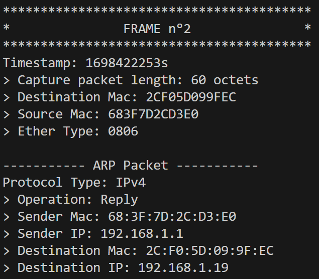

# projet réseau - Pcap Reader
Ce projet a pour but d'analyser le contenue binaire des fichiers pcap pris en entrée par mon programme.  
Le programme permet de faire les informations de chaque couches du modèle OSI en partant de la plus basse (ex: Ethernet) à la plus haute (ex: HTTP).  


Pré-requis:
- Java
------  
## Architecture
Le projet contient une classe Ethernet principal.
Chaque frame ethernet est lue à l'aide de cette classe.  
Pour lire les informations des couches plus hautes, une classe est instanciée pour chacunes d'entre elles afin de lire les informations importantes de ces dernières et de les ressortir sur la console.  

*Remarque*: Tous mes fichiers java sont situé dans le dossier src à la racine de mon projet mis à part le fichier **PcapReader.java**. De plus, tous les fichiers sont situés à la racine du projet 

## Utilisation  
**Compilation**
```bash
javac PcapReader.java
```  
**Exécution**
*Sans filtre*
```bash
java PcapReader.java ".\file.pcap"
```
*Avec filtre*
```bash
java PcapReader.java ".\file.pcap filter=[filter_value]"
```

> *Remarque*:  
> - Le programme n'est pas case sensitive, donce vous pouvez écrire 'UDP'
> - Il n'y a que les protocoles de transport qui sont supportés pour le filter (udp, tcp, icmp)

#### Fichiers d'utilisation
Vous pouvez tester le programme avec les fichiers pcap suivant:  
- dns.pcap (2 frames Ethernet)
- http.pcap (12 frames Ethernet)
- dhcp.pcap (2 frames Ethernet)
- icmpPing.pcap (2 frames Ethernet)
- arp.pcap (2 frames Ethernet)

Voici un exemple de sortie de mon fichier pcap, dans le cas d'une lecture de paquet du protocole ARP.   
  

> *Remarque*:  
> Par manque de temps:  
> - Le protocole QUIC n'est pas analysé  
> - Le Follow TCP-Stream n'est pas implémenté